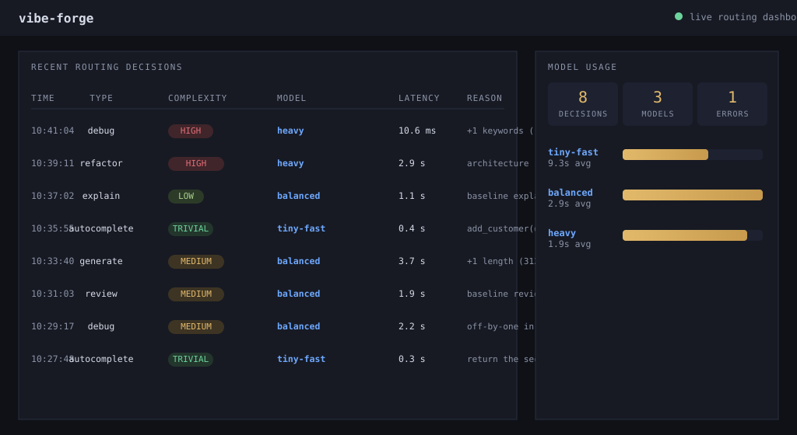
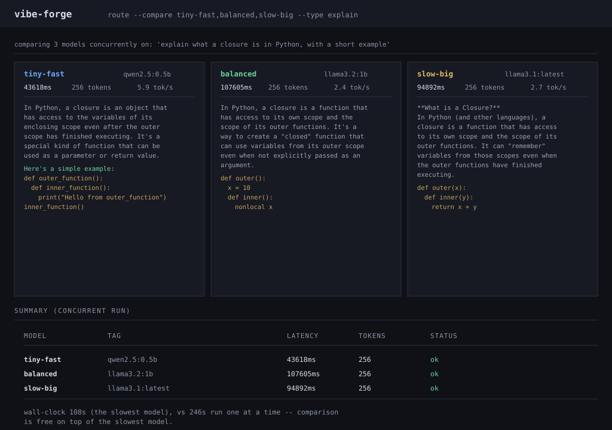

# vibe-forge

Local-first policy router for coding assistants.
Routes coding subtasks to different local LLMs (via [Ollama](https://ollama.com)) based on task
complexity — so trivial tasks hit small fast models and hard tasks hit stronger ones.
**Fully offline. Zero cloud API costs. Zero code leaves your machine.**

[](https://github.com/qtjg/vibe-forge/actions/workflows/ci.yml)
[](LICENSE)
[](https://www.python.org/)
[](https://ollama.com)

---

## Why

- **No cloud API costs** — every inference runs on your own hardware.
- **Works offline** — the router itself is pure rule-based logic; no telemetry, no phone home.
- **Hardware-aware** — pick models that fit your RAM; the router always picks the *cheapest*
  model that can do the job, so you never waste seconds on a 14B model for a one-liner.

```
             Task                 Scorer                 Registry              Executor
  ┌───────────────────┐   ┌───────────────────┐   ┌───────────────────┐   ┌───────────────────┐
  │ "fix this race    │   │ HeuristicScorer   │   │ ModelRegistry     │   │ OllamaExecutor    │
  │  condition"       │──▶│ baseline + length │──▶│ cheapest tier     │──▶│ POST /api/generate│──▶ llama3.1
  │ type=debug        │   │ + keyword signals │   │ covering tier     │   │ times latency     │    qwen2.5 ...
  └───────────────────┘   └───────────────────┘   └───────────────────┘   └───────────────────┘
                                explainable              user-editable
                                reason string            models.yaml
```

Each layer is a swappable unit: a new Scorer, a new model lineup, or a new executor can be
dropped in without touching the rest. Every decision carries a plain-English `reason`, so
routing is auditable end to end. An experimental embeddings-based scorer can be swapped in
per-call (`route --scorer embedding`) without touching the policy.

## Quickstart

```bash
# 1. Install Ollama and pull your models
curl -fsSL https://ollama.com/install.sh | sh
ollama pull qwen2.5:0.5b        # tiny-fast tier (trivial tasks)
ollama pull llama3.1:latest     # balanced tier (everyday tasks)
ollama pull qwen2.5-coder:14b   # heavy tier (hard tasks) — optional

# 2. Install vibe-forge
pip install vibe-forge        # core routing; add [dashboard] for the live UI
pip install "vibe-forge[dashboard]"   # dashboard + history UI

# 3. Route a task
vibeforge route "explain this regex: (?P<year>\d{4})" --type explain
vibeforge route "fix this race condition" --type debug --file mycode.py --execute
```

> `route` without `--execute` makes **no Ollama call at all** — pure local scoring, works
> with Ollama offline.

### Watch it live

```bash
vibeforge serve                   # terminal 1: dashboard on http://localhost:8420
vibeforge route "quick one-liner 3D-dash" --type autocomplete \
    --execute --dashboard http://localhost:8420    # terminal 2: appears live
```



### Compare models side by side

```bash
vibeforge route "explain what a closure is in Python, with a short example" \
    --type explain --compare tiny-fast,balanced,heavy
```

Runs every listed tier concurrently on the same prompt (thread pool, per-model failure
isolation) and prints each output plus a summary table. Noisy single runs stop being a
basis for taste — you see them side by side.



## Configuration

Model tiers live in `models.yaml` (user-editable, or set `VIBEFORGE_MODELS` to point
elsewhere). The router never hardcodes tiers.

```yaml
models:
  - name: tiny-fast
    ollama_tag: qwen2.5:0.5b
    complexity_ceiling: trivial    # trivial < low < medium < high
    approx_ram_gb: 0.6             # "cheapest" = lowest RAM
    notes: "Blazing fast; ideal for autocomplete and one-liners"

  - name: balanced
    ollama_tag: llama3.1:latest
    complexity_ceiling: medium
    approx_ram_gb: 4.9
    notes: "The recommended default; handles most everyday tasks"

  - name: heavy
    ollama_tag: qwen2.5-coder:14b
    complexity_ceiling: high
    approx_ram_gb: 9.0
    notes: "Strongest tier; architecture, debugging, and reviews"
```

Tiers are assigned by `approx_ram_gb` — the smallest model whose ceiling covers the task
wins. If nothing covers the task, the most capable model is the fallback (never a crash).

### Custom task types (no code edits)

Task types are a registry, not a hardcoded enum: add your own through the same
`models.yaml` and they route like built-ins (`--type`, the dashboard, and
`--compare` all accept them).

```yaml
custom_task_types:
  - name: translate          # visible in --type / dashboard
    baseline_rank: 1         # scoring baseline, 0 (trivial) .. 3 (high)
    description: "Translate code between languages"
```

Types you register here are validated up front (a name that shadows a built-in,
or duplicates, is a config error) and scored by the heuristic scorer at their
baseline. The six built-ins stay: `autocomplete`, `explain`, `generate`,
`refactor`, `debug`, `review`.

## How scoring works

The `HeuristicScorer` (no ML dependencies, fully deterministic) produces a complexity in
`{trivial, low, medium, high}` from three signals:

| Signal | Rule |
|---|---|
| Task-type baseline | `autocomplete` → trivial; `explain`/`generate` → low; `refactor`/`debug`/`review` → medium |
| Prompt + context length | > 200 words: +1, > 800 words: +2 |
| High-signal keywords | `concurrency`, `race condition`, `memory leak`, `deadlock`, `architecture`, `security`, `async`, `distributed`, ... → +1 (≥ 3 hits: +2) |

The score is clamped to the 4-tier scale, and every decision records *why*:

```
baseline debug=2 (medium) +1 length (412 words) +1 keywords (race condition) => score 3 (high)
```

Every decision also carries a deterministic **confidence** (0..1) reflecting how much
evidence the scorer saw, plus a **token budget** (`num_predict`) matched to the chosen
tier — `vibeforge route --execute` uses it automatically. Scorer knobs (baselines,
keywords, length thresholds) can be tuned per instance:

```python
strict = HeuristicScorer(baseline_ranks={TaskType.REVIEW: 3}, length_bumps=((100, 1),))
```

### Experimental: embeddings-based scoring

`EmbeddingScorer` (opt-in via `route --scorer embedding --embedding-model nomic-embed-text`)
embeds the task against labeled example prompts bundled in
`vibeforge/data/embedding-examples.yaml` and picks the closest tier. Seed embeddings are
cached per model; when no embeddings can be computed the scorer falls back to the heuristic
and says so in the `reason`. It also never raises.

Honest first numbers: on the 36-task suite the embedding scorer agreed with the heuristic
on **12/36 tiers (33.3%)** but was ~two orders of magnitude slower (~100 ms/task warm vs
~0.2 ms, plus model load). Raw data: `results/scorer-comparison.csv`. This is a research
artifact, not a claim of an improvement — agreement, not accuracy.

## Benchmarking

`vibeforge bench` runs the fixed 36-task suite against every model in your registry
and writes a pandas-friendly `benchmark_results.csv` — the data source for the
[research paper](CITATION.cff):

```bash
vibeforge bench                              # all models x all tasks
vibeforge bench --task-type debug            # scope to one task type
vibeforge bench --output results-2026.csv    # custom output
```

Each row: `model_name, model_tag, task_id, task_type, latency_ms, eval_count,
tokens_per_sec, output_chars, error`. Failures are recorded in the `error` column, never
aborting the run.

To compare the heuristic scorer against the embedding scorer on the same 36 tasks
(one row per task, both tier choices + per-call latency):

```bash
vibeforge compare-scorers --output results/scorer-comparison.csv
```

## Diagnostics

`vibeforge doctor` is a read-only once-over of your install — it never
changes anything:

```bash
vibeforge doctor
```

It validates the config, checks Ollama is reachable, flags configured tiers
you haven't pulled (with the exact `ollama pull` command), and suggests a
ready-to-paste tier entry for any pulled model that isn't in your
`models.yaml` yet. Exit code 1 on hard errors (config, unreachable Ollama,
no pulled model at all), 0 otherwise — safe for CI.

Install the optional `[hardware]` extra for hardware-aware tier calibration:

```bash
pip install "vibe-forge[hardware]"    # optional: psutil + RAM detection
```

With it, doctor also reads system RAM (and GPU VRAM via `nvidia-smi` if
present) and warns when a configured tier's `approx_ram_gb` can't fit —
the exact chip that the next release's auto-scaffolded `models.yaml`
(5.3 `init`) builds on. Without the extra, doctor tells you how to enable
it and skips RAM checks gracefully.

## VS Code extension

A minimal extension ([`vscode-extension/`](vscode-extension/)) routes the selected text
through a running dashboard (`vibeforge serve`) and can execute the prompt against the
chosen model. Selection → **vibe-forge: Route Selection** → decision popup → “Run it” puts
the generated output in a `vibe-forge` output channel. It talks only to the dashboard API
(`POST /api/route`, `POST /api/execute`) — see its README for the local install steps.

## Project layout

```
vibeforge/
├── types.py              # Task, Complexity, ModelTier, RoutingDecision, ExecutionResult
├── router/
│   ├── task_types.py     # TaskTypeRegistry: built-ins + custom types from models.yaml
│   ├── complexity.py     # Scorer protocol + HeuristicScorer (rule-based)
│   ├── embedding.py      # EmbeddingScorer (experimental, nearest-neighbor)
│   ├── registry.py       # ModelRegistry: models.yaml -> cheapest covering tier
│   ├── schema.py         # pydantic validation of the models config
│   ├── policy.py         # PolicyRouter: score -> pick -> history
│   └── executor.py       # OllamaExecutor via the official ollama client
├── eval/                 # scorer evaluation: labeled set, metrics, runner, CSV
├── data/                 # bundled models.yaml + the 48-task ground-truth eval set
├── benchmark/            # fixed 36-task suite + runner + scorer comparison (CSV out)
├── compare_models.py     # concurrent multi-model execution (route --compare)
├── dashboard/            # FastAPI app + SQLite decision store + vanilla-JS static page
└── cli/                  # vibeforge route | bench | serve | eval | compare-scorers
```

## Development

```bash
pip install -e ".[dev]"
pytest            # 276 tests, no Ollama required (HTTP is mocked)
ruff check .      # lint
ruff format --check .  # formatting
```

The evaluation harness is reproducible by design: the labeled set and the
last full run's results are committed (`vibeforge/data/eval-set.yaml`,
`results/eval-results.csv`), so anyone can re-run `vibeforge eval` and diff
against them without trusting the README's numbers.

The dashboard API has no build step; the contract is covered by
`tests/test_dashboard.py` (decisions/stats, route, execute, persistence), and the VS Code
extension is thin glue over that contract.

See [CONTRIBUTING.md](CONTRIBUTING.md) for how to add task types, scorers, and tasks.

## Roadmap

See [ROADMAP.md](ROADMAP.md).

## License

[MIT](LICENSE) © 2026 Mayank Bhaskar. If you use the benchmark data in a paper, cite via
[CITATION.cff](CITATION.cff).